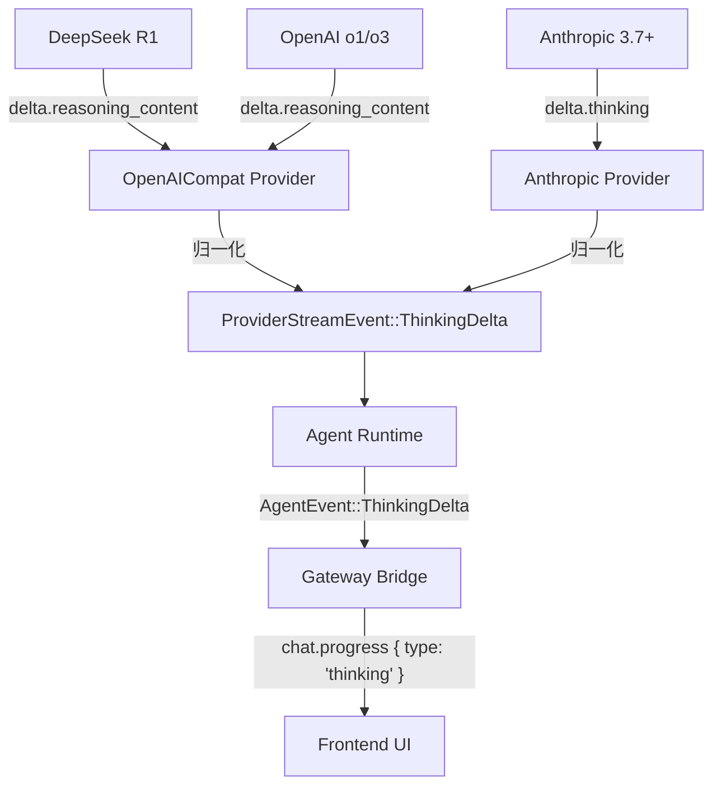

# 多模型 Reasoning/Thinking 归一化详细设计 (Phase 4)

- **版本**：2.0.0
- **日期**：2026-04-19
- **状态**：Draft
- **关联文档**：[thinking-visualization-design.md](file:///d:/git/zero-nova/docs/design/thinking-visualization-design.md)

## 1. 设计目标

Phase 4 的核心目标是消除不同 LLM 提供商在"思考过程"（Reasoning/Thinking）输出格式上的差异，确保 `Agent Runtime` 和前端 UI 能够以统一的方式处理来自 OpenAI (o1/o3)、DeepSeek-R1、Anthropic 等模型的推理流。

主要挑战：字段名不统一、输出顺序差异、模型特定的配置参数。

### 1.1 当前代码状态

| 组件 | 现状 | 缺口 |
| :--- | :--- | :--- |
| `AnthropicStreamReceiver` | Phase 1-3 已完成：`BlockType` 状态机、`ThinkingDelta` 发射、请求侧 `ThinkingConfig` 附加 | 无 |
| `OpenAiCompatStreamReceiver` | **空壳**：`next_event()` 直接 `return Ok(None)`，无任何流式解析 | 全部：text、tool_calls、usage、error、reasoning |
| `SseParser` | SSE 帧拆分正常，`[DONE]` 已处理 | `next_event()` 硬编码反序列化为 Anthropic 的 `StreamEvent`，OpenAI 层不可复用 |
| `ModelConfig` | 已有 `thinking_budget: Option<u32>` | OpenAI 的 `reasoning_effort` 是枚举而非 token 数，语义不匹配 |

**结论**：OpenAI 兼容层当前不可用。Phase 4 需拆分为两个子阶段：先完成基础流式解析 (4a)，再叠加 reasoning 归一化 (4b)。

## 2. 归一化流 (Normalization Pipeline)

所有 Provider 必须将各自原始的流式事件转换为 `ProviderStreamEvent` 枚举。



---

## 3. Phase 4a — OpenAI 兼容层基础流式解析

### 3.1 前置条件：SseParser 泛化

当前 `SseParser::next_event()` 直接反序列化为 Anthropic 的 `StreamEvent`，OpenAI 的 JSON 结构完全不同。需要新增一个通用方法来提取原始 JSON 字符串，让各 Provider 自行反序列化。

**目标文件**：`src/provider/sse.rs`

```rust
impl SseParser {
    /// 提取下一个 SSE 帧的原始 data 内容（不做 JSON 反序列化）。
    /// 返回 Ok(None) 表示缓冲区中没有完整帧，或收到 [DONE] 信号。
    /// 返回 Ok(Some(RawSseEvent::Done)) 表示流结束。
    /// 返回 Ok(Some(RawSseEvent::Data(String))) 表示一帧原始 JSON。
    pub fn next_raw(&mut self) -> Result<Option<RawSseEvent>> {
        if let Some(pos) = self.find_double_newline() {
            let raw_bytes = self.buffer[..pos].to_vec();
            let terminator_len = 2;
            let _ = self.buffer.drain(..pos + terminator_len);
            let raw_str = std::str::from_utf8(&raw_bytes)?;

            let mut data_content = String::new();
            for line in raw_str.lines() {
                let line = line.trim();
                if let Some(rest) = line.strip_prefix("data: ") {
                    data_content.push_str(rest);
                }
            }

            let json_str = data_content.trim();
            if json_str.is_empty() {
                return self.next_raw();
            }
            if json_str == "[DONE]" {
                return Ok(Some(RawSseEvent::Done));
            }
            return Ok(Some(RawSseEvent::Data(json_str.to_string())));
        }
        Ok(None)
    }
}

pub enum RawSseEvent {
    Data(String),
    Done,
}
```

**兼容性**：现有的 `next_event()` 保持不变，Anthropic Provider 继续使用。OpenAI 兼容层使用 `next_raw()` + 自行反序列化。

### 3.2 OpenAI 流式 JSON 结构定义

**目标文件**：`src/provider/openai_compat.rs`

OpenAI Chat Completions 流式响应的 JSON 结构与 Anthropic 完全不同，需要独立的反序列化类型。

```rust
use serde::Deserialize;

/// OpenAI Chat Completion 流式块
#[derive(Debug, Deserialize)]
struct ChatCompletionChunk {
    // id: String,              // 暂不使用
    // model: String,           // 暂不使用
    choices: Vec<ChunkChoice>,
    #[serde(default)]
    usage: Option<OpenAiUsage>,  // 仅在最后一个 chunk 中出现（需 stream_options）
}

#[derive(Debug, Deserialize)]
struct ChunkChoice {
    // index: usize,
    delta: ChunkDelta,
    #[serde(default)]
    finish_reason: Option<String>,
}

#[derive(Debug, Deserialize)]
struct ChunkDelta {
    #[serde(default)]
    role: Option<String>,        // 首个 chunk 携带 "assistant"
    #[serde(default)]
    content: Option<String>,
    #[serde(default)]
    tool_calls: Option<Vec<ChunkToolCall>>,
}

#[derive(Debug, Deserialize)]
struct ChunkToolCall {
    index: usize,               // tool_call 的序号，用于增量拼接
    #[serde(default)]
    id: Option<String>,         // 仅在 tool_call 首个 chunk 携带
    #[serde(default)]
    function: Option<ChunkFunction>,
}

#[derive(Debug, Deserialize)]
struct ChunkFunction {
    #[serde(default)]
    name: Option<String>,       // 仅在 tool_call 首个 chunk 携带
    #[serde(default)]
    arguments: Option<String>,  // 增量 JSON 片段
}

/// OpenAI 格式的 usage（字段名与 Anthropic 不同）
#[derive(Debug, Deserialize)]
struct OpenAiUsage {
    prompt_tokens: u64,
    completion_tokens: u64,
}
```

### 3.3 Tool Call 增量组装状态机

OpenAI 的 tool_calls 通过 `index` 字段标识同一个调用的增量片段，与 Anthropic 的 `content_block_start/delta/stop` 模型完全不同。需要在 `OpenAiCompatStreamReceiver` 中维护组装状态。

```rust
/// 正在组装中的 tool call
#[derive(Debug, Clone)]
struct PendingToolCall {
    id: String,
    name: String,
    arguments_buffer: String,
}

pub struct OpenAiCompatStreamReceiver {
    response: reqwest::Response,
    parser: SseParser,
    /// 按 index 存储正在组装的 tool calls
    pending_tool_calls: Vec<Option<PendingToolCall>>,
    pending_stop_reason: Option<StopReason>,
    /// 缓存待发射的事件（单个 chunk 可能产生多个 ProviderStreamEvent）
    event_queue: VecDeque<ProviderStreamEvent>,
}
```

### 3.4 `next_event()` 核心解析逻辑

```rust
#[async_trait]
impl StreamReceiver for OpenAiCompatStreamReceiver {
    async fn next_event(&mut self) -> Result<Option<ProviderStreamEvent>> {
        loop {
            // 1. 先消费缓冲队列
            if let Some(event) = self.event_queue.pop_front() {
                return Ok(Some(event));
            }

            // 2. 从 SSE 帧中取原始 JSON
            match self.parser.next_raw()? {
                Some(RawSseEvent::Done) => {
                    // [DONE] 信号：发射所有未关闭的 tool calls 的 End 事件，再发 MessageComplete
                    self.flush_pending_tool_calls();
                    return Ok(self.event_queue.pop_front());
                    // 后续调用将返回 Ok(None)
                }
                Some(RawSseEvent::Data(json_str)) => {
                    let chunk: ChatCompletionChunk = serde_json::from_str(&json_str)
                        .map_err(|e| anyhow!("Failed to parse OpenAI chunk: {}, content: {}", e, json_str))?;
                    self.process_chunk(chunk);
                    // 回到循环顶部消费 event_queue
                    continue;
                }
                None => {
                    // 缓冲区中没有完整帧，读取更多数据
                }
            }

            // 3. 从 HTTP response 读取更多数据
            match self.response.chunk().await? {
                Some(bytes) => self.parser.feed(&bytes),
                None => return Ok(None),
            }
        }
    }
}
```

### 3.5 Chunk 处理逻辑

```rust
impl OpenAiCompatStreamReceiver {
    fn process_chunk(&mut self, chunk: ChatCompletionChunk) {
        // --- Usage 处理 ---
        // OpenAI 仅在设置 stream_options.include_usage 时，在最后一个 chunk 返回 usage
        if let Some(usage) = chunk.usage {
            self.event_queue.push_back(ProviderStreamEvent::MessageComplete {
                usage: crate::provider::types::Usage {
                    input_tokens: usage.prompt_tokens,
                    output_tokens: usage.completion_tokens,
                    cache_creation_input_tokens: 0,  // OpenAI 无此字段
                    cache_read_input_tokens: 0,
                },
                stop_reason: self.pending_stop_reason.take(),
            });
            return;
        }

        let Some(choice) = chunk.choices.first() else { return };

        // --- finish_reason 处理 ---
        if let Some(reason) = &choice.finish_reason {
            self.pending_stop_reason = Some(match reason.as_str() {
                "stop" => StopReason::EndTurn,
                "length" => StopReason::MaxTokens,
                "tool_calls" => StopReason::ToolUse,
                _ => StopReason::Unknown,
            });
        }

        let delta = &choice.delta;

        // --- Text content ---
        if let Some(content) = &delta.content {
            if !content.is_empty() {
                self.event_queue.push_back(ProviderStreamEvent::TextDelta(content.clone()));
            }
        }

        // --- Tool calls 增量组装 ---
        if let Some(tool_calls) = &delta.tool_calls {
            for tc in tool_calls {
                let idx = tc.index;
                // 确保 pending_tool_calls 容量足够
                while self.pending_tool_calls.len() <= idx {
                    self.pending_tool_calls.push(None);
                }

                if let Some(id) = &tc.id {
                    // 新 tool call 的首个 chunk：发射 ToolUseStart
                    let name = tc.function.as_ref()
                        .and_then(|f| f.name.as_ref())
                        .cloned()
                        .unwrap_or_default();
                    self.pending_tool_calls[idx] = Some(PendingToolCall {
                        id: id.clone(),
                        name: name.clone(),
                        arguments_buffer: String::new(),
                    });
                    self.event_queue.push_back(ProviderStreamEvent::ToolUseStart {
                        id: id.clone(),
                        name,
                    });
                }

                // 追加 arguments 增量
                if let Some(func) = &tc.function {
                    if let Some(args) = &func.arguments {
                        if !args.is_empty() {
                            if let Some(Some(pending)) = self.pending_tool_calls.get_mut(idx) {
                                pending.arguments_buffer.push_str(args);
                            }
                            self.event_queue.push_back(
                                ProviderStreamEvent::ToolUseInputDelta(args.clone()),
                            );
                        }
                    }
                }
            }
        }
    }

    /// 在流结束时（[DONE] 或 finish_reason=tool_calls），关闭所有未完成的 tool calls
    fn flush_pending_tool_calls(&mut self) {
        let count = self.pending_tool_calls.iter().filter(|p| p.is_some()).count();
        for _ in 0..count {
            self.event_queue.push_back(ProviderStreamEvent::ToolUseEnd);
        }
        self.pending_tool_calls.clear();

        // 如果还有未发射的 MessageComplete
        if let Some(reason) = self.pending_stop_reason.take() {
            self.event_queue.push_back(ProviderStreamEvent::MessageComplete {
                usage: crate::provider::types::Usage::default(),
                stop_reason: Some(reason),
            });
        }
    }
}
```

### 3.6 请求构建改造

当前请求构建需要补充以下内容：

#### 3.6.1 `stream_options` — 获取 Usage

OpenAI 流式模式默认不返回 usage，必须显式请求：

```rust
body["stream_options"] = json!({ "include_usage": true });
```

#### 3.6.2 Thinking 内容的回传策略

当历史消息中包含 `ContentBlock::Thinking` 时，不同 Provider 的处理策略不同：

- **Anthropic**：必须回传，API 要求包含之前的 thinking 块（Phase 1-3 已实现）。
- **OpenAI 兼容**：**应跳过**。OpenAI API 不理解 thinking 内容块，将其作为普通 text 回传会污染上下文。

```rust
// 在 OpenAiCompatClient::stream() 构建 input_messages 时：
crate::message::ContentBlock::Thinking { .. } => {
    // OpenAI 兼容层不回传 thinking 内容，直接跳过
    continue;
}
```

#### 3.6.3 OpenAI Tool Call 格式适配

当前 `openai_compat.rs` 中 tool_calls 的请求格式需要调整，OpenAI 使用消息级别的 `tool_calls` 字段而非 content block：

```rust
// Assistant 消息中包含 tool_use 时，需要转换为 OpenAI 的格式：
// { "role": "assistant", "content": "...", "tool_calls": [...] }
// ToolResult 需要转换为独立的 tool role 消息：
// { "role": "tool", "tool_call_id": "...", "content": "..." }
```

> 这部分的完整实现细节较多，将在实现时根据 OpenAI API 文档细化。此处仅标注方向。

### 3.7 错误处理

OpenAI 兼容 API 的错误响应格式与 Anthropic 不同：

```json
{
  "error": {
    "message": "...",
    "type": "invalid_request_error",
    "code": "..."
  }
}
```

需要在 `process_chunk` 中增加错误检测，或在 HTTP 层面通过 `error_for_status()` 捕获（当前已实现）。对于流式过程中的错误（如 context length exceeded），需要解析 JSON 中的 `error` 字段：

```rust
// 在 next_raw() 返回的 JSON 中检测错误
if let Ok(err_obj) = serde_json::from_str::<serde_json::Value>(&json_str) {
    if let Some(error) = err_obj.get("error") {
        let msg = error.get("message").and_then(|m| m.as_str()).unwrap_or("Unknown error");
        return Err(anyhow!("OpenAI API Error: {}", msg));
    }
}
```

### 3.8 Phase 4a 改动文件清单

| 文件 | 改动类型 | 改动内容 |
| :--- | :--- | :--- |
| `src/provider/sse.rs` | 修改 | 新增 `RawSseEvent` 枚举和 `next_raw()` 方法 |
| `src/provider/openai_compat.rs` | **重写** | 新增 OpenAI JSON 反序列化类型；实现完整的 `next_event()` 解析；tool call 增量组装状态机；Usage 归一化；请求构建修正（`stream_options`、tool 格式、thinking 跳过） |

---

## 4. Phase 4b — Reasoning/Thinking 归一化

Phase 4b 在 4a 的基础上，新增 `reasoning_content` 字段的解析，将 OpenAI/DeepSeek 的推理内容映射为 `ProviderStreamEvent::ThinkingDelta`。

### 4.1 JSON Schema 扩展

在 §3.2 的 `ChunkDelta` 中新增 `reasoning_content` 字段：

```rust
#[derive(Debug, Deserialize)]
struct ChunkDelta {
    #[serde(default)]
    role: Option<String>,
    #[serde(default)]
    content: Option<String>,
    #[serde(default)]
    reasoning_content: Option<String>,  // Phase 4b 新增
    #[serde(default, alias = "reasoning")]  // 兼容 Groq 等使用 "reasoning" 的 Provider
    reasoning_alias: Option<String>,
    #[serde(default)]
    tool_calls: Option<Vec<ChunkToolCall>>,
}
```

**关于 `#[serde(alias)]` 的风险说明**：`alias` 在反序列化时全局生效，无法按 Provider 切换。当前采用此方案是为了简化实现。如果将来某 Provider 的 `reasoning` 字段语义不同，需要改为手动提取（从 `serde_json::Value` 中按配置读取字段名）。

### 4.2 `process_chunk` 扩展

在 §3.5 的 `process_chunk()` 中，**在 text content 处理之前**插入 reasoning 处理：

```rust
fn process_chunk(&mut self, chunk: ChatCompletionChunk) {
    // ... usage 处理 ...
    // ... finish_reason 处理 ...

    let delta = &choice.delta;

    // --- Reasoning content（优先于普通 text）---
    let reasoning = delta.reasoning_content.as_ref()
        .or(delta.reasoning_alias.as_ref());  // fallback 到 alias
    if let Some(reasoning) = reasoning {
        if !reasoning.is_empty() {
            self.event_queue.push_back(
                ProviderStreamEvent::ThinkingDelta(reasoning.clone()),
            );
        }
    }

    // --- Text content ---
    if let Some(content) = &delta.content {
        if !content.is_empty() {
            self.event_queue.push_back(
                ProviderStreamEvent::TextDelta(content.clone()),
            );
        }
    }

    // --- Tool calls ---
    // ... 与 4a 相同 ...
}
```

**混合 chunk 处理**：如果单个 chunk 同时包含 `reasoning_content` 和 `content`（理论上不应发生，但需防御），两个事件都会被推入 `event_queue`，按 reasoning → text 的顺序发射。这比 §5 旧设计中的短路 `return` 更健壮。

### 4.3 配置与启用

#### 4.3.1 `ModelConfig` 拆分

`thinking_budget: Option<u32>` 在 Anthropic 侧语义清晰（对应 `budget_tokens`），但 OpenAI 的 `reasoning_effort` 是三档枚举（`low` / `medium` / `high`），无法用 token 数表达。建议拆分为 Provider 感知的配置：

```rust
/// src/provider/mod.rs
#[derive(Debug, Clone, Serialize, Deserialize)]
pub struct ModelConfig {
    pub model: String,
    pub max_tokens: u32,
    pub temperature: Option<f64>,
    pub top_p: Option<f64>,
    /// Anthropic: 映射为 budget_tokens; 其他 Provider: 仅作为"是否启用"的开关
    pub thinking_budget: Option<u32>,
    /// OpenAI: 映射为 reasoning_effort 参数 ("low"/"medium"/"high")
    /// DeepSeek: 忽略（模型默认启用 reasoning）
    pub reasoning_effort: Option<String>,
}
```

#### 4.3.2 各 Provider 请求构建

| Provider | 配置字段 | 请求参数 |
| :--- | :--- | :--- |
| Anthropic | `thinking_budget: Some(8192)` | `thinking: { type: "enabled", budget_tokens: 8192 }`, 强制 `temperature: 1.0` |
| OpenAI (o1/o3) | `reasoning_effort: Some("medium")` | `reasoning_effort: "medium"` |
| DeepSeek-R1 | 无需配置 | 模型默认输出 `reasoning_content`，Provider 直接解析即可 |

```rust
// OpenAiCompatClient::stream() 中：
if let Some(effort) = &config.reasoning_effort {
    body["reasoning_effort"] = json!(effort);
}
```

### 4.4 关键差异点处理

| 差异项 | Anthropic | OpenAI / DeepSeek | 归一化策略 |
| :--- | :--- | :--- | :--- |
| **触发方式** | `thinking: { type: "enabled", budget_tokens }` | 模型自行决定 / `reasoning_effort` | `ModelConfig` 分别提供 `thinking_budget` 和 `reasoning_effort` |
| **流式字段** | `delta.thinking` (在 `content_block_delta` 中) | `delta.reasoning_content` (在 `choices[0].delta` 中) | 映射至 `ProviderStreamEvent::ThinkingDelta(String)` |
| **内容顺序** | 严格先 Thinking 后 Text | 通常先 Reasoning 后 Text | 引擎按序转发即可 |
| **温度约束** | `temperature: 1.0` (强制) | o1 系列不支持温度参数 | 由 Provider 层在构建 Request 时自动处理 |
| **Thinking 回传** | API 要求回传 thinking 块 | API 无此概念，应跳过 | Provider 层在 `stream()` 构建消息时分别处理 |

### 4.5 Phase 4b 改动文件清单

| 文件 | 改动类型 | 改动内容 |
| :--- | :--- | :--- |
| `src/provider/openai_compat.rs` | 修改 | `ChunkDelta` 新增 `reasoning_content` / `reasoning_alias` 字段；`process_chunk()` 新增 reasoning 提取逻辑；请求构建新增 `reasoning_effort` 参数 |
| `src/provider/mod.rs` | 修改 | `ModelConfig` 新增 `reasoning_effort: Option<String>` 字段 |

---

## 5. 异常情况处理

1. **空值过滤**：Provider 层必须过滤掉所有内容为空字符串的 delta，避免向上层发送空事件。
2. **混合 chunk**：单个 chunk 同时包含 `reasoning_content` 和 `content` 时，使用 `event_queue` 模式依次发射，不丢弃任何内容。
3. **Provider 特定字段**：使用 `#[serde(alias)]` 作为初始简化方案。已知风险：alias 全局生效，无法按 Provider 动态切换。如果将来出现字段名冲突，需退回到 `serde_json::Value` 手动提取。
4. **Usage 格式差异**：OpenAI 使用 `prompt_tokens` / `completion_tokens`，Anthropic 使用 `input_tokens` / `output_tokens`。在 OpenAI 层反序列化后映射为统一的 `Usage` 结构体，缺失字段（`cache_*`）填 0。
5. **`[DONE]` vs `message_stop`**：OpenAI 流式以 `data: [DONE]` 结束，Anthropic 以 `message_stop` 事件结束。`SseParser` 已处理 `[DONE]`，各 Provider 的 `next_event()` 分别处理各自的结束信号。

## 6. 测试策略

### 6.1 单元测试

为每个 Provider 的流式解析器编写独立的单元测试，使用预录制的 SSE 数据：

```rust
#[cfg(test)]
mod tests {
    /// 验证 text delta 的基础解析
    #[tokio::test]
    async fn test_openai_text_delta() { /* mock SSE data: content field */ }

    /// 验证 tool_calls 的增量组装
    #[tokio::test]
    async fn test_openai_tool_call_assembly() { /* mock SSE data: multi-chunk tool call */ }

    /// 验证 reasoning_content 映射为 ThinkingDelta
    #[tokio::test]
    async fn test_openai_reasoning_content() { /* mock SSE data: reasoning_content field */ }

    /// 验证 reasoning_content 和 content 同时出现时均被发射
    #[tokio::test]
    async fn test_openai_mixed_reasoning_and_content() { /* mock SSE data */ }

    /// 验证 usage 归一化（prompt_tokens → input_tokens）
    #[tokio::test]
    async fn test_openai_usage_normalization() { /* mock SSE data with usage chunk */ }

    /// 验证 DeepSeek 格式（字段相同，但行为略有差异）
    #[tokio::test]
    async fn test_deepseek_reasoning() { /* mock SSE data */ }
}
```

### 6.2 集成测试

使用真实 API（需配置 key）验证端到端流式传输。标记为 `#[ignore]` 以避免 CI 中意外调用。

## 7. 实施顺序

### Phase 4a（基础流式解析）

1. `SseParser` 新增 `next_raw()` 方法
2. 定义 OpenAI 流式 JSON 反序列化类型
3. 实现 `OpenAiCompatStreamReceiver::next_event()` — text + tool_calls
4. 实现 Usage 归一化和 `stream_options` 请求参数
5. 修正请求构建：tool 格式、Thinking 跳过、错误处理
6. 编写单元测试（text、tool_calls、usage、error）

### Phase 4b（Reasoning 归一化）

1. `ChunkDelta` 新增 `reasoning_content` 字段
2. `process_chunk()` 新增 reasoning 提取逻辑
3. `ModelConfig` 新增 `reasoning_effort` 字段
4. 请求构建新增 `reasoning_effort` 参数
5. 编写单元测试（reasoning 解析、混合 chunk、alias 兼容）
