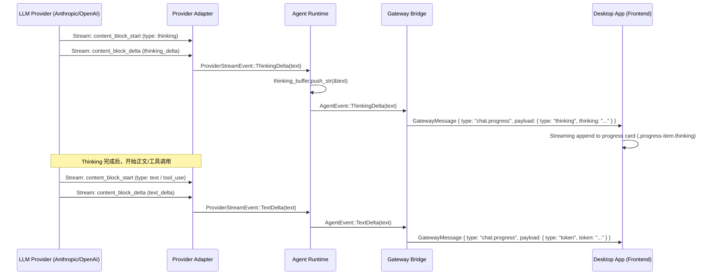

# 思考过程与运行进度可视化设计文档

- **版本**：2.0.0
- **日期**：2026-04-19
- **状态**：Draft

## 1. 背景与目标

为了提升 Zero-Nova 的透明度和用户体验，我们需要展示 AI 在得出最终结论之前的"思考过程"（Reasoning/Thinking）以及调用的工具（Tool Use）明细。本设计致力于通过后端事件归一化和前端流式展示，提供一种统一且精致的交互体验。

### 1.1 当前状态

| 层级 | 现状 | 缺口 |
|------|------|------|
| Provider (`ProviderStreamEvent`) | 仅有 `TextDelta`, `ToolUse*`, `MessageComplete` | 无 `ThinkingDelta` 变体 |
| Agent Runtime (`AgentEvent`) | 仅有 `TextDelta`, `ToolStart/End`, `TurnComplete` | 无 `Thinking` 变体 |
| Gateway Bridge | `ProgressEvent` 已预留 `thinking` 字段 | `agent_event_to_gateway()` 无 Thinking 分支 |
| Frontend | `handleGatewayProgress` 已有 `thinking` 分支处理 | 后端从未发送该事件，属死代码 |
| 数据模型 (`ContentBlock`) | `Text`, `ToolUse`, `ToolResult` | 无 `Thinking` 变体 |

**结论**：前端和 Gateway 协议已预埋了 thinking 支持，核心缺口在 Provider → Agent 的流式管道。

### 1.2 Anthropic Extended Thinking API

Claude 3.7+ 的 Extended Thinking 通过请求参数 `thinking.type = "enabled"` 和 `thinking.budget_tokens` 激活。响应中会产生 `type: "thinking"` 的内容块，其 delta 类型为 `thinking_delta`（字段名 `thinking` 而非 `text`）。

关键约束：
- 启用 thinking 时，`temperature` 必须设为 `1`，不支持自定义 `top_p`。
- `budget_tokens` 必须 < `max_tokens`。
- Thinking 内容块始终出现在 Text 和 ToolUse 之前。

## 2. 系统架构

系统采用分层架构，确保不同模型的差异在 Provider 层被消除。



## 3. 后端详细设计

### 3.1 统一数据模型 (`src/message.rs`)

新增 `Thinking` 变体，使思考过程成为消息对象的原生部分。

```rust
// src/message.rs
#[derive(Debug, Clone, PartialEq, Serialize, Deserialize)]
#[serde(tag = "type", rename_all = "snake_case")]
pub enum ContentBlock {
    Text { text: String },
    Thinking { thinking: String },  // 新增：保存 AI 的推理过程
    ToolUse { id: String, name: String, input: serde_json::Value },
    ToolResult { tool_use_id: String, output: String, is_error: bool },
}
```

**注意**：字段名使用 `thinking` 而非 `text`，与 Anthropic API 的 thinking content block 保持一致。

### 3.2 Provider 层改造

#### 3.2.1 `ProviderStreamEvent` 新增变体 (`src/provider/mod.rs`)

```rust
#[derive(Debug, Clone)]
pub enum ProviderStreamEvent {
    TextDelta(String),
    ThinkingDelta(String),  // 新增
    ToolUseStart { id: String, name: String },
    ToolUseInputDelta(String),
    ToolUseEnd,
    MessageComplete { usage: Usage, stop_reason: Option<StopReason> },
}
```

#### 3.2.2 `MessageRequest` 扩展 (`src/provider/types.rs`)

```rust
#[derive(Debug, Serialize, Deserialize)]
pub struct MessageRequest {
    pub model: String,
    pub max_tokens: u32,
    #[serde(skip_serializing_if = "Option::is_none")]
    pub temperature: Option<f64>,
    #[serde(skip_serializing_if = "Option::is_none")]
    pub top_p: Option<f64>,
    pub stream: bool,
    pub messages: Vec<InputMessage>,
    #[serde(skip_serializing_if = "Option::is_none")]
    pub system: Option<String>,
    #[serde(skip_serializing_if = "Option::is_none")]
    pub tools: Option<Vec<ToolDefinition>>,
    #[serde(skip_serializing_if = "Option::is_none")]
    pub thinking: Option<ThinkingConfig>,  // 新增
}

#[derive(Debug, Serialize, Deserialize, Clone)]
pub struct ThinkingConfig {
    #[serde(rename = "type")]
    pub kind: String,           // "enabled"
    pub budget_tokens: u32,     // 思考预算 token 数
}
```

#### 3.2.3 Anthropic Provider 适配 (`src/provider/anthropic.rs`)

**核心改造点 1**：`AnthropicStreamReceiver` 新增 block 类型追踪。

```rust
pub struct AnthropicStreamReceiver {
    response: reqwest::Response,
    parser: SseParser,
    current_tool_id: Option<String>,
    current_tool_name: Option<String>,
    pending_stop_reason: Option<StopReason>,
    current_block_type: Option<BlockType>,  // 新增
}

#[derive(Debug, Clone, PartialEq)]
enum BlockType {
    Text,
    Thinking,
    ToolUse,
}
```

**核心改造点 2**：`ContentBlockStart` 处理逻辑扩展。

```rust
// 在 next_event() 的 match event 中：
StreamEvent::ContentBlockStart { content_block, .. } => {
    let block_type = content_block.get("type").and_then(|t| t.as_str());
    match block_type {
        Some("tool_use") => {
            let id = content_block.get("id")...;
            let name = content_block.get("name")...;
            self.current_block_type = Some(BlockType::ToolUse);
            self.current_tool_id = Some(id.clone());
            self.current_tool_name = Some(name.clone());
            ProviderStreamEvent::ToolUseStart { id, name }
        }
        Some("thinking") => {
            self.current_block_type = Some(BlockType::Thinking);
            continue;  // thinking 块开始时不产生事件，等待 delta
        }
        Some("text") => {
            self.current_block_type = Some(BlockType::Text);
            continue;
        }
        _ => continue,
    }
}
```

**核心改造点 3**：`ContentBlockDelta` 根据当前块类型分流。

```rust
StreamEvent::ContentBlockDelta { delta, .. } => {
    match self.current_block_type {
        Some(BlockType::Thinking) => {
            // thinking delta 的字段名是 "thinking"，不是 "text"
            if let Some(thinking) = delta.get("thinking").and_then(|t| t.as_str()) {
                ProviderStreamEvent::ThinkingDelta(thinking.to_string())
            } else {
                continue;
            }
        }
        Some(BlockType::ToolUse) => {
            if let Some(partial_json) = delta.get("partial_json").and_then(|p| p.as_str()) {
                ProviderStreamEvent::ToolUseInputDelta(partial_json.to_string())
            } else {
                continue;
            }
        }
        _ => {
            // Text block 或未知类型
            if let Some(text) = delta.get("text").and_then(|t| t.as_str()) {
                ProviderStreamEvent::TextDelta(text.to_string())
            } else {
                continue;
            }
        }
    }
}
```

**核心改造点 4**：`ContentBlockStop` 清理 block 类型状态。

```rust
StreamEvent::ContentBlockStop { .. } => {
    let was_tool = self.current_block_type == Some(BlockType::ToolUse);
    self.current_block_type = None;
    if was_tool {
        self.current_tool_id = None;
        self.current_tool_name = None;
        ProviderStreamEvent::ToolUseEnd
    } else {
        continue;
    }
}
```

**核心改造点 5**：请求构建中条件附加 thinking 配置。

在 `LlmClient::stream()` 实现中，`ModelConfig` 需要增加 thinking 相关配置：

```rust
// src/provider/mod.rs
#[derive(Debug, Clone, Serialize, Deserialize)]
pub struct ModelConfig {
    pub model: String,
    pub max_tokens: u32,
    pub temperature: Option<f64>,
    pub top_p: Option<f64>,
    pub thinking_budget: Option<u32>,  // 新增：None 表示不启用
}
```

在 `AnthropicClient::stream()` 中构建请求体时：

```rust
let body = MessageRequest {
    // ...existing fields...
    thinking: config.thinking_budget.map(|budget| ThinkingConfig {
        kind: "enabled".to_string(),
        budget_tokens: budget,
    }),
};
```

**约束处理**：当 `thinking_budget.is_some()` 时，强制 `temperature = Some(1.0)`，忽略用户设置的 temperature/top_p。

### 3.3 `AgentEvent` 新增变体 (`src/event.rs`)

```rust
#[derive(Debug, Clone, serde::Serialize, serde::Deserialize)]
pub enum AgentEvent {
    TextDelta(String),
    ThinkingDelta(String),  // 新增：思考过程增量
    ToolStart { id: String, name: String, input: serde_json::Value },
    ToolEnd { id: String, name: String, output: String, is_error: bool },
    TurnComplete { new_messages: Vec<Message>, usage: Usage },
    IterationLimitReached { iterations: usize },
    Error(String),
}
```

### 3.4 Agent Runtime 处理 (`src/agent.rs`)

在 `run_turn()` 的流式事件循环中，新增 thinking 累积逻辑：

```rust
let mut current_text = String::new();
let mut current_thinking = String::new();  // 新增
let mut tool_calls = Vec::new();

while let Some(event) = receiver.next_event().await? {
    match event {
        ProviderStreamEvent::ThinkingDelta(delta) => {
            current_thinking.push_str(&delta);
            let _ = event_tx.send(AgentEvent::ThinkingDelta(delta)).await;
        }
        ProviderStreamEvent::TextDelta(delta) => {
            current_text.push_str(&delta);
            let _ = event_tx.send(AgentEvent::TextDelta(delta)).await;
        }
        // ...其余不变
    }
}
```

构建 `current_blocks` 时，将 thinking 放在最前面：

```rust
let mut current_blocks = Vec::new();
if !current_thinking.is_empty() {
    current_blocks.push(ContentBlock::Thinking { thinking: current_thinking });
}
if !current_text.is_empty() {
    current_blocks.push(ContentBlock::Text { text: current_text });
}
// ...tool_use blocks
```

### 3.5 Gateway Bridge 转换 (`src/gateway/bridge.rs`)

新增 `ThinkingDelta` 到 `ProgressEvent` 的转换分支：

```rust
AgentEvent::ThinkingDelta(text) => MessageEnvelope::ChatProgress(ProgressEvent {
    kind: "thinking".to_string(),
    session_id: Some(session_id.to_string()),
    thinking: Some(text),
    ..Default::default()
}),
```

### 3.6 Thinking 内容的 API 回传处理

Anthropic API 要求：当 thinking 启用时，后续请求中必须包含之前的 thinking 内容块。在 `AnthropicClient::stream()` 构建 `input_messages` 时，需要处理 `ContentBlock::Thinking`：

```rust
crate::message::ContentBlock::Thinking { thinking } => {
    content_vec.push(json!({"type": "thinking", "thinking": thinking}));
}
```

同时需要在 `InputContentBlock` 中新增对应变体：

```rust
#[derive(Debug, Serialize, Deserialize)]
#[serde(tag = "type", rename_all = "snake_case")]
pub enum InputContentBlock {
    Text { text: String },
    Thinking { thinking: String },  // 新增
    ToolUse { id: String, name: String, input: serde_json::Value },
    ToolResult { tool_use_id: String, output: String, is_error: bool },
}
```

## 4. 前端详细设计

### 4.1 当前实现分析

前端已有较完善的 thinking 事件处理，位于 `deskapp/src/main.ts:3691-3693`：

```typescript
if (progressEvent.type === 'thinking' && progressEvent.thinking) {
    updateTypingText(progressEvent.thinking);
    addProgressToChat('·', progressEvent.thinking, true);
}
```

以及离屏会话缓存中的处理（`main.ts:3661-3662`）：

```typescript
} else if (event.type === 'thinking' && (event as any).thinking) {
    cached.items.push({ icon: '·', text: (event as any).thinking, isThinking: true });
}
```

### 4.2 需要改进的点

#### 4.2.1 流式追加优化

当前实现对每个 `thinking` 事件都调用 `addProgressToChat` 创建新行。由于 thinking delta 是高频小增量（类似 token 流），这会导致进度卡片中产生大量行。需要改为**同质追加**模式：

```typescript
let lastProgressType: string | null = null;

if (progressEvent.type === 'thinking' && progressEvent.thinking) {
    updateTypingText(progressEvent.thinking);
    if (lastProgressType === 'thinking') {
        // 追加到已有的 thinking 行
        const thinkingItems = document.querySelectorAll('.progress-item.thinking .progress-text');
        const lastItem = thinkingItems[thinkingItems.length - 1];
        if (lastItem) {
            lastItem.textContent += progressEvent.thinking;
        }
    } else {
        addProgressToChat('·', progressEvent.thinking, true);
    }
    lastProgressType = 'thinking';
} else if (progressEvent.type === 'tool_start') {
    // ...现有逻辑
    lastProgressType = 'tool_start';
} else if (progressEvent.type === 'token') {
    lastProgressType = 'token';
    // ...现有逻辑
}
```

#### 4.2.2 思考内容截断与折叠

思考过程可能非常长（数千 token）。显示策略：

- 进度卡片中默认只显示前 200 字符 + "..."省略号。
- 点击可展开查看完整内容。
- 完成后自动折叠（跟随整个进度卡片的折叠行为）。

#### 4.2.3 视觉区分

为 `.progress-item.thinking` 添加区分样式（`main.css`）：

```css
.progress-item.thinking .progress-text {
    font-style: italic;
    color: var(--text-secondary);
    opacity: 0.8;
}
```

### 4.3 状态转换完整流程

```
用户发送消息
    → showTyping() + setStatus('思考中', 'running')
    → [thinking events] → 进度卡片追加思考行，typing indicator 显示思考摘要
    → [tool_start] → 进度卡片更新标题，显示工具名
    → [tool_result] → 进度卡片追加工具结果行
    → [token events] → hideTyping(), 流式渲染最终回复
    → [complete] → hideTyping(), finishProgressCard() (自动折叠), finishStreamingMessage()
```

## 5. 配置设计

### 5.1 用户侧配置

thinking 功能通过模型配置控制。在 Agent 配置或会话设置中新增：

```yaml
# .nova/config.yaml
llm:
  model: claude-sonnet-4-20250514
  max_tokens: 16384
  thinking_budget: 8192  # 可选，设置后启用 extended thinking
```

### 5.2 模型兼容性

| 模型 | Thinking 支持 | Delta 字段 |
|------|-------------|-----------|
| Claude Sonnet 4 / Opus 4 | 原生 (content_block type: thinking) | `delta.thinking` |
| Claude 3.5 Sonnet | 不支持 | N/A |
| OpenAI o1/o3 | `reasoning_content` in delta | `delta.reasoning_content` |
| DeepSeek-R1 | `reasoning_content` in delta | `delta.reasoning_content` |

Provider 层将所有差异归一化为 `ProviderStreamEvent::ThinkingDelta`，上层无需感知模型差异。

## 6. 改动文件清单

| 文件 | 改动类型 | 改动内容 |
|------|---------|---------|
| `src/message.rs` | 修改 | `ContentBlock` 新增 `Thinking` 变体 |
| `src/provider/mod.rs` | 修改 | `ProviderStreamEvent` 新增 `ThinkingDelta`；`ModelConfig` 新增 `thinking_budget` |
| `src/provider/types.rs` | 修改 | `MessageRequest` 新增 `thinking` 字段；新增 `ThinkingConfig` 结构体；`InputContentBlock` 新增 `Thinking` 变体 |
| `src/provider/anthropic.rs` | 修改 | `AnthropicStreamReceiver` 新增 `current_block_type`；`ContentBlockStart/Delta/Stop` 处理逻辑重构；请求构建添加 thinking 参数 |
| `src/event.rs` | 修改 | `AgentEvent` 新增 `ThinkingDelta` 变体 |
| `src/agent.rs` | 修改 | `run_turn()` 新增 thinking 累积与事件发送逻辑 |
| `src/gateway/bridge.rs` | 修改 | `agent_event_to_gateway()` 新增 `ThinkingDelta` 转换分支 |
| `deskapp/src/main.ts` | 修改 | `handleGatewayProgress` thinking 分支改为流式追加模式 |
| `deskapp/src/main.css` | 修改 | `.progress-item.thinking` 样式增强 |

## 7. 实施顺序

1. **Phase 1 - 数据管道打通**（后端）
   - 修改 `ContentBlock`, `ProviderStreamEvent`, `AgentEvent` 三个枚举
   - 改造 `AnthropicStreamReceiver` 的 block 类型追踪和 delta 分流
   - 在 `run_turn()` 中累积 thinking 并发送事件
   - 在 `agent_event_to_gateway()` 中添加转换分支

2. **Phase 2 - 请求侧支持**（后端）
   - `ModelConfig` 新增 `thinking_budget`
   - `MessageRequest` 新增 `thinking` 参数
   - `AnthropicClient::stream()` 构建请求时附加 thinking 配置
   - 处理 temperature 约束（thinking 启用时强制 temperature=1）
   - `ContentBlock::Thinking` 的 API 回传序列化

3. **Phase 3 - 前端优化**
   - `handleGatewayProgress` 改为同质追加模式
   - 增加 thinking 内容截断/折叠交互
   - 样式调整

4. **Phase 4 - 多模型扩展**（后续）
   - OpenAI `reasoning_content` 适配
   - DeepSeek-R1 适配

## 8. 注意事项

1. **性能**：thinking delta 是高频事件，前端追加文本时应直接操作 DOM textContent，避免触发整个卡片的重排/重绘。
2. **内存**：`current_thinking` 可能累积到数万字符。Agent Runtime 中应考虑设置上限或采用环形缓冲策略（仅保留最近 N 字符用于前端展示，完整内容仅存历史）。
3. **序列化兼容**：`ContentBlock` 使用 `#[serde(tag = "type")]`，新增 `Thinking` 变体会自动生成 `"type": "thinking"`，与现有持久化格式向后兼容（旧数据不含该变体，反序列化时不会出错）。
4. **Thinking 不参与工具调用判断**：`tool_calls.is_empty()` 的判断逻辑无需改动，thinking 仅影响 content blocks 的构建。
5. **非 thinking 模型的兼容**：当模型不支持 thinking 或未配置 `thinking_budget` 时，整个管道中不会出现任何 thinking 事件，行为与当前完全一致。
