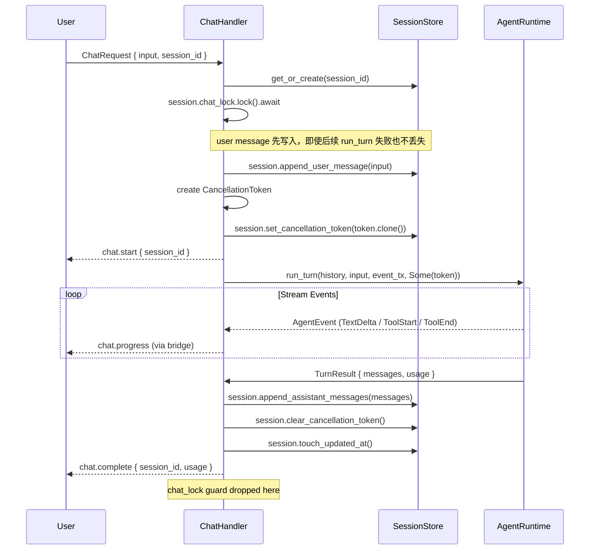
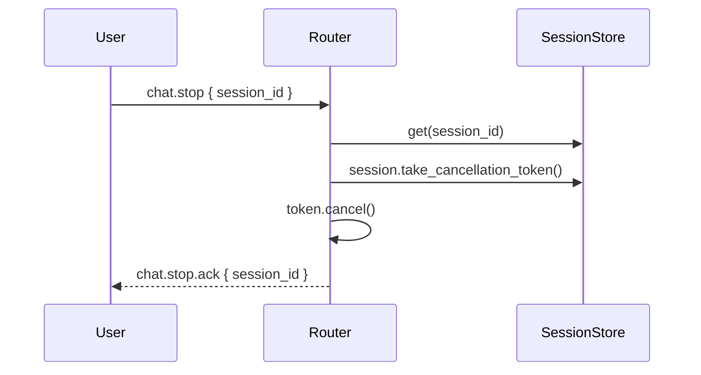

# Phase 3：会话模型与聊天生命周期修正

> 前置依赖：Phase 2
> 基线代码：`src/gateway/session.rs`、`src/gateway/handlers/chat.rs`、`src/agent.rs`

## 1. 目标

当前系统已经能跑 chat，但 `session` 和 `chat` 生命周期仍然比较粗糙。
第三阶段要解决的是：**让"消息写入顺序、历史读取、并发约束、完成态"一致化。**

## 2. 当前代码现状

基于 `src/gateway/session.rs` 和 `src/gateway/handlers/chat.rs` 的现状，存在以下问题：

1. **`chat_lock` 已定义但未使用**：`Session` 上声明了 `chat_lock: Mutex<()>`，但 `handle_chat` 中没有调用 `lock()`。同一 session 的并发 chat 请求可以同时操作历史，存在数据竞争风险。
2. **消息写入顺序不安全**：当前 user message 和 assistant messages 的写入由 handler 直接操作 `session.history.write()`，没有封装为 SessionStore 方法，散落在 handler 逻辑中。
3. **`updated_at` 不存在**：`Session` 没有 `updated_at` 字段，`sessions.list` 响应中用 `created_at` 替代，无法按活跃度排序。
4. **无 DTO 隔离**：`sessions.messages` 直接透出内部 `Message` 结构，内外模型耦合。
5. **`run_turn` 返回值缺少 `Usage`**：`run_turn` 返回 `Result<Vec<Message>>`，usage 信息仅在 `TurnComplete` 事件中携带。但自然完成时 `TurnComplete` 不会被发送，导致 `chat.complete` 的 `usage` 永远为 `None`。
6. **`ChatStop` 未接入**：协议定义了 `chat.stop`，`CancellationToken` 已在 `run_turn` 签名中支持，但 router 没有路由 `ChatStop`，无法取消正在进行的对话。

## 3. 详细设计 (Detailed Design)

### 3.1 数据模型 (Data Structures)

#### Session 核心扩展
```rust
pub struct Session {
    pub id: String,
    pub name: String,
    pub history: RwLock<Vec<Message>>,
    pub created_at: i64,
    pub updated_at: AtomicI64,       // 新增：支持按活跃度排序，使用原子类型避免额外锁
    pub chat_lock: Mutex<()>,        // 串行锁：防止同会话并发 Turn
    pub cancellation_token: RwLock<Option<CancellationToken>>, // 新增：支持 chat.stop
}
```

#### 外部协议模型 (MessageDTO)
不再直接透出内部 `Message` 结构，使用稳定的 DTO：
```rust
#[derive(Serialize)]
pub struct MessageDTO {
    pub role: String,
    pub content: Vec<ContentBlockDTO>,
    pub timestamp: i64,
}

#[derive(Serialize)]
#[serde(tag = "type")]
pub enum ContentBlockDTO {
    #[serde(rename = "text")]
    Text { text: String },
    #[serde(rename = "tool_use")]
    ToolUse { id: String, name: String, input: serde_json::Value },
    #[serde(rename = "tool_result")]
    ToolResult { tool_use_id: String, content: String, is_error: bool },
}
```

#### run_turn 返回值重构
```rust
pub struct TurnResult {
    pub messages: Vec<Message>,
    pub usage: Usage,
}

// run_turn 签名变更
pub async fn run_turn(
    &self,
    history: &[Message],
    user_input: &str,
    event_tx: mpsc::Sender<AgentEvent>,
    cancellation_token: Option<CancellationToken>,
) -> Result<TurnResult>
```

这样 `chat.complete` 可以携带真实的 usage 数据，不再依赖 `TurnComplete` 事件。

### 3.2 核心流程 (Core Flow)

修正后的 `handle_chat` 执行时序：



#### chat.stop 处理流程



### 3.3 SessionStore API 定义

```rust
impl Session {
    /// 追加 user message 到历史
    pub fn append_user_message(&self, input: &str);
    /// 追加 assistant 返回的消息（可能包含多条：assistant + tool_result 等）
    pub fn append_assistant_messages(&self, msgs: Vec<Message>);
    /// 获取完整历史，用于传入 run_turn
    pub fn get_history(&self) -> Vec<Message>;
    /// 获取 DTO 格式的历史，用于协议输出
    pub fn get_messages_dto(&self) -> Vec<MessageDTO>;
    /// 更新 updated_at 为当前时间
    pub fn touch_updated_at(&self);
    /// 设置/清除/获取 cancellation token
    pub fn set_cancellation_token(&self, token: CancellationToken);
    pub fn clear_cancellation_token(&self);
    pub fn take_cancellation_token(&self) -> Option<CancellationToken>;
}

impl SessionStore {
    pub async fn create(&self, name: Option<String>) -> Arc<Session>;
    pub async fn get(&self, id: &str) -> Option<Arc<Session>>;
    pub async fn get_or_create(&self, id: Option<String>) -> Arc<Session>;
    /// 按 updated_at 降序返回会话摘要列表
    pub async fn list_sorted(&self) -> Vec<SessionSummary>;
    pub async fn delete(&self, id: &str) -> bool;
}

#[derive(Serialize)]
pub struct SessionSummary {
    pub id: String,
    pub name: String,
    pub created_at: i64,
    pub updated_at: i64,
    pub message_count: usize,
}
```

### 3.4 错误处理策略

| 场景 | 行为 |
|------|------|
| `run_turn` 返回 `Err` | user message 已在历史中（不丢失）；发送 `error` 消息给客户端；释放 `chat_lock` |
| 事件发送失败（`event_tx` closed） | `run_turn` 内部忽略发送错误，继续执行直到完成 |
| `chat.stop` 到达时无活跃 chat | 返回 `error { code: "NO_ACTIVE_CHAT" }` |
| session 不存在时收到 `chat.stop` | 返回 `error { code: "SESSION_NOT_FOUND" }` |

## 4. 本 phase 范围

### 4.1 要做

- 给 `Session` 增加 `updated_at`（`AtomicI64`）和 `cancellation_token` 字段
- 将消息操作封装为 `Session` 方法（`append_user_message` / `append_assistant_messages` / `get_history` / `get_messages_dto`）
- 在 `handle_chat` 中启用 `chat_lock`（当前已定义但未使用）
- 修正 `handle_chat` 的写入顺序：user message 在 `run_turn` 之前写入
- 实现 `MessageDTO` / `ContentBlockDTO` 转换，用于 `sessions.messages` 输出
- 实现 `SessionStore::list_sorted`，按 `updated_at` 降序
- 实现 `SessionStore::delete`
- 重构 `run_turn` 返回 `TurnResult { messages, usage }` 替代 `Vec<Message>`
- 路由 `ChatStop` 到 cancellation 逻辑

### 4.2 不做

- 不做持久化数据库（保留内存实现）
- 不做 history summary / trimming
- 不做 workflow / agent context / control state
- 不做 `sessions.logs` / `sessions.artifacts`（保持 `NOT_IMPLEMENTED`）

## 5. 实施步骤

### Step 1：重构 `run_turn` 返回值

文件：
- `src/agent.rs`
- `src/event.rs`

动作：
- 新增 `TurnResult` 结构体
- `run_turn` 返回 `Result<TurnResult>` 而非 `Result<Vec<Message>>`
- 在 `run_turn` 内部累计 usage，在函数返回时一并带出
- `TurnComplete` 事件保留但 bridge 不再映射为 `ChatComplete`（bridge 中该分支改为 `ChatProgress { kind: "turn_complete" }`，仅供调试）

### Step 2：扩展 Session 数据模型

文件：
- `src/gateway/session.rs`

动作：
- 增加 `updated_at: AtomicI64` 字段
- 增加 `cancellation_token: RwLock<Option<CancellationToken>>` 字段
- 实现 `Session` 上的消息操作方法
- 实现 `MessageDTO` / `ContentBlockDTO`
- 实现 `SessionStore::list_sorted` / `delete` / `get_or_create`

### Step 3：修正 handle_chat

文件：
- `src/gateway/handlers/chat.rs`

动作：
- 在入口处 `chat_lock.lock().await`
- 先写入 user message，再调用 `run_turn`
- 使用 `TurnResult.usage` 填充 `chat.complete` 的 usage 字段
- 创建并注册 `CancellationToken`

### Step 4：接入 ChatStop

文件：
- `src/gateway/router.rs`
- `src/gateway/handlers/chat.rs`（新增 `handle_chat_stop`）

动作：
- 在 router 中增加 `ChatStop` 分支
- 取出 session 的 cancellation token 并 cancel

### Step 5：更新 sessions handlers

文件：
- `src/gateway/handlers/sessions.rs`

动作：
- `sessions.list` 使用 `list_sorted` 并输出 `SessionSummary`
- `sessions.messages` 使用 `get_messages_dto` 输出 `MessageDTO`
- 接入 `sessions.delete`

## 6. 测试方案

### 6.1 单元测试（`src/gateway/session.rs`）

| 测试用例 | 验证点 |
|---------|-------|
| `test_append_user_message` | user message 正确追加到 history |
| `test_append_assistant_messages` | 多条消息正确追加 |
| `test_touch_updated_at` | `updated_at` 值大于 `created_at` |
| `test_get_messages_dto` | DTO 转换正确，字段完整 |
| `test_list_sorted` | 按 `updated_at` 降序排列 |
| `test_get_or_create` | 已有 session 返回同一实例；无 session 时创建新实例 |
| `test_delete` | 删除后 `get` 返回 `None` |

### 6.2 并发测试（`src/gateway/session.rs`）

| 测试用例 | 验证点 |
|---------|-------|
| `test_chat_lock_serialization` | 两个 `chat_lock.lock()` 不会同时持有 |
| `test_concurrent_append` | 多线程追加消息后 history 长度正确 |

### 6.3 集成测试（`src/gateway/handlers/chat.rs`）

| 测试用例 | 验证点 |
|---------|-------|
| `test_user_message_persists_on_error` | mock `run_turn` 返回 Err，验证 user message 已在 history 中 |
| `test_chat_complete_has_usage` | 验证 `chat.complete` 消息中 `usage` 不为 None |
| `test_chat_stop_cancels` | 发送 `chat.stop` 后 `CancellationToken` 已 cancelled |

### 6.4 回归要求

```powershell
cargo clippy --workspace -- -D warnings
cargo fmt --check --all
cargo test --workspace
```

## 7. 完成定义

- [ ] `Session` 具有 `updated_at` 和 `cancellation_token` 字段
- [ ] `chat_lock` 在 `handle_chat` 中生效
- [ ] user message 在 `run_turn` 之前写入历史
- [ ] `run_turn` 返回 `TurnResult`（含 usage）
- [ ] `chat.complete` 携带真实 usage
- [ ] `ChatStop` 已路由且能取消进行中的对话
- [ ] `sessions.list` 按 `updated_at` 降序
- [ ] `sessions.messages` 输出 `MessageDTO`
- [ ] `sessions.delete` 已实现
- [ ] 全部测试用例通过

## 8. 给下一阶段的交接信息

Phase 3 完成后：
- `Session` 是一个稳定的、有完整 API 的对象，可安全地在 Phase 4 扩展控制层状态
- `handle_chat` 的写入顺序、锁机制、取消机制已固定，Phase 4 改造为 `route_turn -> execute_turn` 时不需要再修正这些基础逻辑
- `run_turn` 的返回值已标准化，Phase 4 的 `TurnRouter` 可以基于 `TurnResult` 做后处理
