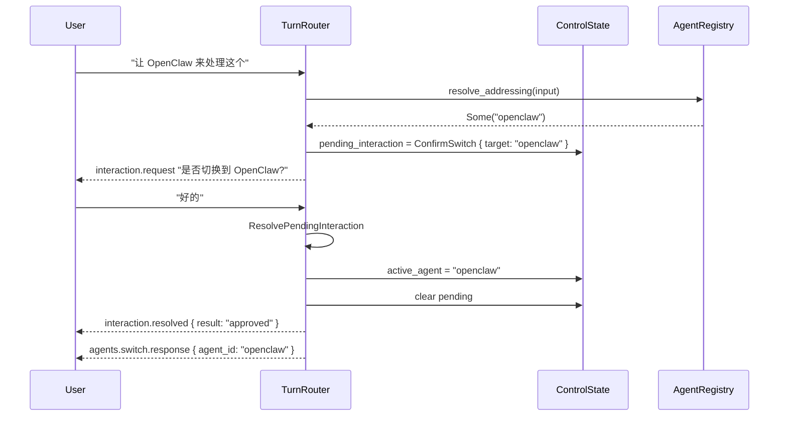

# Phase 5：Workflow 与 Multi-Agent 接入

> 前置依赖：Phase 4
> 基线设计：`docs/conversation-control-plane-design.md`

## 1. 目标

将 Phase 4 的控制层骨架填充具体逻辑：
- 引入 **SolutionWorkflow** 实现长流程任务的显式状态管理
- 引入 **AgentRegistry** 实现多 agent 注册、点名与切换
- 让 `TurnRouter` 的 `AddressAgent` 和 `ContinueWorkflow` 分支真正工作

## 2. 当前代码现状（Phase 4 完成后预期）

Phase 4 完成后已具备：
- `Session.control: RwLock<ControlState>` 含 `active_agent` / `pending_interaction` / `workflow` 字段
- `TurnRouter::classify` 能分类四种意图，但 `AddressAgent` 和 `ContinueWorkflow` 的判断逻辑和执行逻辑是占位实现
- `PendingInteraction` + `InteractionResolver` 基础设施已就绪
- `AppState` 只持有一个 `AgentRuntime<C>`，不支持多 agent

需要解决的问题：
1. `AppState` 如何支持多 agent（多个 runtime 实例 vs 单 runtime 动态切换 prompt/tools）
2. `SolutionWorkflow` 的状态迁移与 `PendingInteraction` 的联动
3. Agent 点名的识别策略

## 3. 详细设计 (Detailed Design)

### 3.1 Multi-Agent 架构决策

**方案选择：单 LLM Client + 多 Agent 配置**

当前 `AgentRuntime<C>` 是泛型的，创建多个 runtime 实例会增加复杂度。
初版采用更轻量的方案：

- 所有 agent 共享同一个 `LlmClient` 实例（即同一个 API key / endpoint）
- 每个 agent 的差异体现在：system prompt、可用工具集、model config
- 切换 agent = 切换 `AgentDescriptor` + 重建 prompt + 过滤工具

```rust
pub struct AgentDescriptor {
    pub id: String,
    pub display_name: String,
    pub description: String,
    pub aliases: Vec<String>,           // "OpenClaw", "oc", "open-claw"
    pub system_prompt_template: String, // 该 agent 的 system prompt 模板
    pub tool_whitelist: Option<Vec<String>>, // None = 全部工具
    pub model_config: Option<ModelConfig>,   // None = 使用默认
}
```

```rust
pub struct AgentRegistry {
    agents: HashMap<String, AgentDescriptor>,
    primary_agent: String,
}

impl AgentRegistry {
    pub fn new(primary: AgentDescriptor) -> Self;
    pub fn register(&mut self, agent: AgentDescriptor);
    pub fn get(&self, id: &str) -> Option<&AgentDescriptor>;
    pub fn list(&self) -> Vec<&AgentDescriptor>;
    pub fn primary_id(&self) -> &str;

    /// 精确匹配 agent id / display_name / aliases
    /// 初版只做精确匹配（大小写不敏感），不支持指代（"之前那个"）
    pub fn resolve_addressing(&self, text: &str) -> Option<String>;
}
```

**`AppState` 扩展：**

```rust
pub struct AppState<C: LlmClient> {
    pub client: C,                     // 共享的 LLM client
    pub default_agent: AgentRuntime<C>,// 默认 agent runtime（向后兼容）
    pub agent_registry: AgentRegistry,
    pub tool_registry: ToolRegistry,   // 全量工具注册表
    pub sessions: SessionStore,
}
```

当 `active_agent` 切换时，系统根据 `AgentDescriptor` 动态组装 system prompt 和过滤工具集，构造临时的 `AgentRuntime` 或直接修改调用参数。

### 3.2 Agent 点名识别

`resolve_addressing` 的匹配规则：

```rust
impl AgentRegistry {
    pub fn resolve_addressing(&self, text: &str) -> Option<String> {
        let lower = text.to_lowercase();

        for (id, desc) in &self.agents {
            // 匹配模式："让 XX 处理" / "XX 在不在" / "XX，帮我看看" / "@XX"
            let names = std::iter::once(desc.display_name.to_lowercase())
                .chain(desc.aliases.iter().map(|a| a.to_lowercase()));

            for name in names {
                if lower.contains(&name) {
                    return Some(id.clone());
                }
            }
        }
        None
    }
}
```

**明确不支持的场景（初版）：**
- "之前那个 agent" —— 指代解析
- "换一个" —— 隐式切换
- 多 agent 同时被点名 —— 歧义消解

这些场景如需支持，后续可升级为 LLM-based resolver。

### 3.3 Agent 切换流程



**切换时的状态保留策略：**
- `PendingInteraction`：切换前如有非 ConfirmSwitch 的 pending，先自动过期清除
- `WorkflowState`：切换 agent 时保留 workflow 状态（workflow 与 agent 无关，是 session 级的）
- 历史消息：不清空，保持连续对话

### 3.4 SolutionWorkflow 状态机

```rust
pub struct WorkflowState {
    pub workflow_type: WorkflowType,
    pub topic: Option<String>,       // "TTS" / "向量数据库" / "图片生成"
    pub stage: WorkflowStage,
    pub constraints: serde_json::Value,       // 用户提供的约束条件
    pub candidates: Vec<WorkflowCandidate>,   // 搜索到的候选方案
    pub selected_candidate: Option<String>,   // 用户选择的方案 id
    pub created_at: i64,
}

pub enum WorkflowType {
    Solution,
}

pub enum WorkflowStage {
    /// 收集用户需求与约束
    GatherRequirements,
    /// 搜索候选方案
    Discover,
    /// 展示对比，等待用户选择
    AwaitSelection,
    /// 用户已选择，等待部署确认
    AwaitExecutionConfirm,
    /// 部署执行中
    Executing,
    /// 执行完成，等待测试输入
    AwaitTestInput,
    /// 测试中
    Testing,
    /// 流程完成
    Completed,
}

pub struct WorkflowCandidate {
    pub id: String,
    pub name: String,
    pub description: String,
    pub pros: Vec<String>,
    pub cons: Vec<String>,
}
```

#### 阶段迁移与 PendingInteraction 的关系

| 阶段迁移 | 触发 PendingInteraction | 类型 |
|---------|----------------------|------|
| `GatherRequirements` -> `Discover` | `Input` | 收集约束 |
| `Discover` -> `AwaitSelection` | `Select` | 选择候选方案 |
| `AwaitSelection` -> `AwaitExecutionConfirm` | `Approve` (risk: High) | 确认部署 |
| `AwaitExecutionConfirm` -> `Executing` | 用户批准后自动迁移 | - |
| `Executing` -> `AwaitTestInput` | `Input` | 提供测试输入 |

**workflow 不持久化的风险声明：**
当前 workflow 状态在内存中，服务重启会丢失。对于"发现-选型-部署"这样的长流程，这意味着：
- 如果在 `Executing` 阶段服务重启，部署动作的结果可能丢失
- 如果在 `AwaitSelection` 阶段重启，用户需要重新开始

**缓解策略（本 Phase 不实现，仅记录）：**
- 后续可将 `WorkflowState` 序列化到磁盘（JSON 文件或 SQLite）
- `Executing` 阶段的动作应设计为幂等，重复执行不会造成破坏

### 3.5 Workflow 执行引擎

```rust
pub struct WorkflowEngine;

impl WorkflowEngine {
    /// 判断用户输入是否像在继续 workflow
    /// 初版规则：如果 workflow 处于 Await* 阶段，任何输入都视为 workflow 回应
    pub fn looks_like_continuation(input: &str, workflow: &WorkflowState) -> bool {
        matches!(
            workflow.stage,
            WorkflowStage::GatherRequirements
            | WorkflowStage::AwaitSelection
            | WorkflowStage::AwaitExecutionConfirm
            | WorkflowStage::AwaitTestInput
        )
    }

    /// 执行 workflow 的当前阶段
    /// 返回需要发送给用户的消息和可能的 PendingInteraction
    pub async fn advance<C: LlmClient>(
        workflow: &mut WorkflowState,
        input: &str,
        agent: &AgentRuntime<C>,
        event_tx: mpsc::Sender<AgentEvent>,
    ) -> Result<WorkflowAdvanceResult>;
}

pub struct WorkflowAdvanceResult {
    pub new_pending: Option<PendingInteraction>,
    pub messages: Vec<Message>,
    pub stage_changed: bool,
}
```

### 3.6 TurnRouter 更新

Phase 4 的 `TurnRouter::classify` 需要更新以支持真实的 agent 和 workflow 判断：

```rust
impl TurnRouter {
    pub fn classify(
        input: &str,
        control: &ControlState,
        agent_registry: Option<&AgentRegistry>,
    ) -> TurnIntent {
        // 优先级 1：检查并清理过期 pending（与 Phase 4 相同）
        // 优先级 2：挂起交互
        if control.pending_interaction.is_some() {
            return TurnIntent::ResolvePendingInteraction;
        }
        // 优先级 3：agent 点名（Phase 5 真实实现）
        if let Some(registry) = agent_registry {
            if let Some(agent_id) = registry.resolve_addressing(input) {
                if agent_id != control.active_agent {
                    return TurnIntent::AddressAgent { agent_id };
                }
            }
        }
        // 优先级 4：workflow 延续（Phase 5 真实实现）
        if let Some(wf) = &control.workflow {
            if WorkflowEngine::looks_like_continuation(input, wf) {
                return TurnIntent::ContinueWorkflow;
            }
        }
        // 优先级 5：普通聊天
        TurnIntent::ExecuteChat
    }
}
```

## 4. 本 phase 范围

### 4.1 要做

- 实现 `AgentDescriptor` + `AgentRegistry` 数据结构
- 实现 `resolve_addressing`（精确名称/别名匹配，大小写不敏感）
- 实现 Agent 切换流程（通过 `PendingInteraction::ConfirmSwitch`）
- 扩展 `AppState` 增加 `agent_registry` 和 `tool_registry`
- 实现 `SolutionWorkflow` 状态机（`WorkflowState` / `WorkflowStage`）
- 实现 `WorkflowEngine::advance` 至少覆盖 `GatherRequirements -> Discover -> AwaitSelection` 三个阶段
- 实现 `WorkflowEngine::looks_like_continuation`
- 更新 `TurnRouter::classify` 的 `AddressAgent` 和 `ContinueWorkflow` 分支
- 让 `agents.list` 返回 `AgentRegistry` 中的真实数据
- 让 `agents.switch` 真正修改 `ControlState.active_agent`

### 4.2 不做

- 不做 Skill 系统（Phase 6）
- 不做多 Agent 自动协商与任务拆解
- 不做多 Workflow 并行（同一 session 只维护一个 workflow）
- 不做 workflow 持久化（保留内存实现，记录风险）
- 不做指代解析（"之前那个"、"换一个"）
- 不做 `Executing` 阶段的实际部署逻辑（先做状态迁移框架）

## 5. 实施步骤

### Step 1：AgentRegistry

文件：
- `src/gateway/agents.rs`（新建）

动作：
- 定义 `AgentDescriptor` / `AgentRegistry`
- 实现 `resolve_addressing`
- 实现 `register` / `get` / `list`

### Step 2：扩展 AppState

文件：
- `src/gateway/router.rs`
- `src/gateway/mod.rs`

动作：
- `AppState` 增加 `agent_registry` 字段
- `start_server` 初始化时注册默认 agent

### Step 3：SolutionWorkflow

文件：
- `src/gateway/workflow.rs`（新建）

动作：
- 定义 `WorkflowState` / `WorkflowStage` / `WorkflowCandidate`
- 实现 `WorkflowEngine::advance`（至少前三个阶段）
- 实现 `WorkflowEngine::looks_like_continuation`

### Step 4：更新 TurnRouter

文件：
- `src/gateway/control.rs`

动作：
- `classify` 中 `AddressAgent` 使用真实 `AgentRegistry`
- `classify` 中 `ContinueWorkflow` 使用真实 `WorkflowEngine::looks_like_continuation`

### Step 5：更新 handlers

文件：
- `src/gateway/handlers/chat.rs`
- `src/gateway/handlers/agents.rs`

动作：
- `handle_chat` 的 `AddressAgent` 分支：创建 ConfirmSwitch pending
- `handle_chat` 的 `ContinueWorkflow` 分支：调用 `WorkflowEngine::advance`
- `agents.list` 从 `AgentRegistry` 读取
- `agents.switch` 修改 `ControlState.active_agent`

## 6. 测试方案

### 6.1 AgentRegistry 单元测试

| 测试用例 | 验证点 |
|---------|-------|
| `test_resolve_by_display_name` | "OpenClaw" 命中 |
| `test_resolve_by_alias` | "oc" 命中 |
| `test_resolve_case_insensitive` | "openclaw" 命中 |
| `test_resolve_no_match` | 不存在的名字返回 None |
| `test_resolve_self` | 当前 active_agent 被点名时 classify 返回 ExecuteChat 而非 AddressAgent |

### 6.2 SolutionWorkflow 单元测试

| 测试用例 | 验证点 |
|---------|-------|
| `test_stage_gather_to_discover` | 提供约束后迁移到 Discover |
| `test_stage_discover_to_await_selection` | 发现候选后迁移到 AwaitSelection |
| `test_looks_like_continuation` | Await 阶段返回 true，Executing 阶段返回 false |

### 6.3 集成测试

| 测试用例 | 验证点 |
|---------|-------|
| `test_agent_switch_flow` | 点名 -> ConfirmSwitch pending -> 确认 -> active_agent 变更 |
| `test_workflow_preserves_on_agent_switch` | 切换 agent 后 workflow 状态保留 |

### 6.4 回归要求

```powershell
cargo clippy --workspace -- -D warnings
cargo fmt --check --all
cargo test --workspace
```

## 7. 完成定义

- [ ] `AgentRegistry` 能注册、列举、精确匹配 agent
- [ ] 用户通过"让 XX 处理"可触发 agent 切换流程
- [ ] `agents.list` 返回 registry 中的真实 agent 数据
- [ ] `agents.switch` 修改 `ControlState.active_agent`
- [ ] `SolutionWorkflow` 状态机能在前三个阶段间迁移
- [ ] `TurnRouter` 的 `AddressAgent` 和 `ContinueWorkflow` 分支真实工作
- [ ] workflow 持久化风险已记录
- [ ] 全部测试用例通过

## 8. 给下一阶段的交接信息

Phase 5 完成后：
- `AgentRegistry` 已就位，Phase 6 的 Skill 系统可以与 agent 关联（每个 agent 可配置可用 skill 集）
- `SolutionWorkflow` 的状态机框架已就位，Phase 6 可以补充 `Executing` / `Testing` 阶段的实际执行逻辑
- `TurnRouter` 的完整优先级链已工作，Phase 6 的 SkillRouter 作为 `ExecuteChat` 分支的子路由引入
- `AppState` 已扩展为支持多 agent 的结构，Phase 6 的工具过滤可以基于 `(agent_id, skill_id)` 组合
